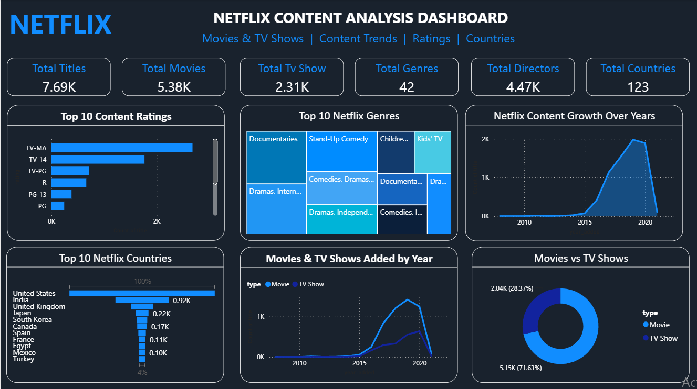

# Netflix Movies & TV Shows — EDA & Power BI Dashboard

An end-to-end **Netflix data analysis project** using Python for data cleaning and Exploratory Data Analysis (EDA), followed by an interactive **Power BI dashboard** to visualize Netflix content and generate insights.

---

## Project Overview

This project analyzes the Netflix Movies and TV Shows dataset to understand:

* Movies vs TV Shows distribution
* Netflix content by country
* Popular genres
* Content ratings
* Content added over the years
* Movies and TV Shows trends over time

The project follows a complete data analysis workflow:

**Raw Data → Data Cleaning → EDA → Data Visualization → Power BI Dashboard → Insights**

---

## Objectives

The main objectives of this project are:

* Clean and prepare the Netflix dataset
* Handle missing and duplicate values
* Analyze Movies and TV Shows distribution
* Identify countries with the most Netflix content
* Analyze popular genres
* Analyze content ratings
* Study Netflix content added by year
* Compare Movies and TV Shows over time
* Build an interactive Power BI dashboard
* Extract meaningful insights from the data

---

## Dataset

The dataset contains information about Netflix Movies and TV Shows.

### Important Columns

| Column         | Description                           |
| -------------- | ------------------------------------- |
| `show_id`      | Unique identifier for each title      |
| `type`         | Movie or TV Show                      |
| `title`        | Title of the content                  |
| `director`     | Director of the content               |
| `country`      | Country associated with the content   |
| `date_added`   | Date the content was added to Netflix |
| `release_year` | Original release year                 |
| `rating`       | Content rating                        |
| `duration`     | Movie duration or TV Show seasons     |
| `listed_in`    | Genre/category                        |
| `description`  | Description of the content            |

---

## Data Cleaning

The dataset was cleaned using **Python and Pandas**.

The following steps were performed:

* Checked the dataset structure using `info()`
* Checked missing values
* Handled missing categorical values using `Unknown`
* Removed unnecessary columns
* Removed duplicate records
* Converted `date_added` into datetime format
* Extracted `year_added`
* Extracted `month_added`
* Handled invalid date values
* Prepared the cleaned dataset for analysis
* Exported the cleaned dataset as `netflix_cleaned.csv`

---

## Exploratory Data Analysis

The following analyses were performed using Python:

### 1. Movies vs TV Shows

Analyzed the distribution of Movies and TV Shows available on Netflix.

### 2. Content Added by Year

Analyzed how many Netflix titles were added during different years.

### 3. Top Countries

Identified countries contributing the most Netflix content.

### 4. Top Genres

Analyzed the most common genres and categories available on Netflix.

### 5. Content Ratings

Analyzed the distribution of Netflix titles across different ratings.

### 6. Movies vs TV Shows Over Time

Compared how Movies and TV Shows were added to Netflix across different years.

---

## Power BI Dashboard

The cleaned dataset was imported into **Microsoft Power BI** to create an interactive dashboard.

### Dashboard Includes

* Total Titles
* Total Movies
* Total TV Shows
* Movies vs TV Shows
* Content by Year
* Top Countries
* Top Genres
* Content Ratings
* Netflix content trends

### Dashboard Preview



---

## Key Insights

The analysis provides the following observations:

* Netflix contains a large collection of both Movies and TV Shows.
* Movies represent a major portion of the available content.
* Netflix content comes from many countries around the world.
* Some countries contribute significantly more titles than others.
* Certain genres appear more frequently in the Netflix catalog.
* Content is distributed across multiple rating categories.
* The number of titles added to Netflix has changed considerably over the years.
* Movies and TV Shows show different patterns in terms of content added over time.

---

## Tools & Technologies

### Programming & Analysis

* Python
* Pandas
* Matplotlib
* Jupyter Notebook

### Data Visualization

* Power BI
* Matplotlib

### Data Format

* CSV

---

## Project Structure

```text
Netflix-Movies-TV-Shows-EDA-PowerBI/
│
├── Netflix (1).ipynb
├── Netflix_movies_tv.csv
├── netflix_cleaned.csv
├── netflix_dashboard1.png
└── README.md
```

---

## Project Workflow

```text
Netflix Dataset
      ↓
Data Cleaning
      ↓
Missing Value Handling
      ↓
Duplicate Removal
      ↓
Date Transformation
      ↓
Exploratory Data Analysis
      ↓
Data Visualization
      ↓
Cleaned Dataset
      ↓
Power BI Dashboard
      ↓
Insights
```

---

## Skills Demonstrated

This project demonstrates practical skills in:

* Data Cleaning
* Exploratory Data Analysis
* Data Visualization
* Python Programming
* Pandas
* Matplotlib
* Power BI
* Dashboard Development
* Data Interpretation
* Business Insights

---

## Conclusion

This project demonstrates a complete **data analysis workflow**, starting from raw Netflix data and progressing through data cleaning, exploratory analysis, visualization, and interactive dashboard development.

The project helped analyze Netflix's content library from different perspectives, including content type, country, genre, ratings, and yearly trends.

It also demonstrates practical experience with **Python, Pandas, Data Visualization, EDA, and Power BI**, which are important skills for data analysis and data science roles.

---

## Future Improvements

The project can be further improved by:

* Adding more advanced Power BI measures using DAX
* Creating additional interactive filters
* Performing deeper genre analysis
* Analyzing director and actor information
* Adding time-series analysis
* Building predictive models based on the dataset

---

## Author

**Hemalatha Lekkala**

B.Sc. Data Science Student

GitHub: [hemalathalekkala](https://github.com/hemalathalekkala)

---

⭐ If you find this project useful, feel free to explore the repository.
# Netflix Movies & TV Shows — EDA & Power BI Dashboard

An end-to-end **Netflix data analysis project** using Python for data cleaning and Exploratory Data Analysis (EDA), followed by an interactive **Power BI dashboard** to visualize Netflix content and generate insights.

---

## Project Overview

This project analyzes the Netflix Movies and TV Shows dataset to understand:

* Movies vs TV Shows distribution
* Netflix content by country
* Popular genres
* Content ratings
* Content added over the years
* Movies and TV Shows trends over time

The project follows a complete data analysis workflow:

**Raw Data → Data Cleaning → EDA → Data Visualization → Power BI Dashboard → Insights**

---

## Objectives

The main objectives of this project are:

* Clean and prepare the Netflix dataset
* Handle missing and duplicate values
* Analyze Movies and TV Shows distribution
* Identify countries with the most Netflix content
* Analyze popular genres
* Analyze content ratings
* Study Netflix content added by year
* Compare Movies and TV Shows over time
* Build an interactive Power BI dashboard
* Extract meaningful insights from the data

---

## Dataset

The dataset contains information about Netflix Movies and TV Shows.

### Important Columns

| Column         | Description                           |
| -------------- | ------------------------------------- |
| `show_id`      | Unique identifier for each title      |
| `type`         | Movie or TV Show                      |
| `title`        | Title of the content                  |
| `director`     | Director of the content               |
| `country`      | Country associated with the content   |
| `date_added`   | Date the content was added to Netflix |
| `release_year` | Original release year                 |
| `rating`       | Content rating                        |
| `duration`     | Movie duration or TV Show seasons     |
| `listed_in`    | Genre/category                        |
| `description`  | Description of the content            |

---

## Data Cleaning

The dataset was cleaned using **Python and Pandas**.

The following steps were performed:

* Checked the dataset structure using `info()`
* Checked missing values
* Handled missing categorical values using `Unknown`
* Removed unnecessary columns
* Removed duplicate records
* Converted `date_added` into datetime format
* Extracted `year_added`
* Extracted `month_added`
* Handled invalid date values
* Prepared the cleaned dataset for analysis
* Exported the cleaned dataset as `netflix_cleaned.csv`

---

## Exploratory Data Analysis

The following analyses were performed using Python:

### 1. Movies vs TV Shows

Analyzed the distribution of Movies and TV Shows available on Netflix.

### 2. Content Added by Year

Analyzed how many Netflix titles were added during different years.

### 3. Top Countries

Identified countries contributing the most Netflix content.

### 4. Top Genres

Analyzed the most common genres and categories available on Netflix.

### 5. Content Ratings

Analyzed the distribution of Netflix titles across different ratings.

### 6. Movies vs TV Shows Over Time

Compared how Movies and TV Shows were added to Netflix across different years.

---

## Power BI Dashboard

The cleaned dataset was imported into **Microsoft Power BI** to create an interactive dashboard.


### Dashboard Includes

* Total Titles
* Total Movies
* Total TV Shows
* Movies vs TV Shows
* Content by Year
* Top Countries
* Top Genres
* Content Ratings
* Netflix content trends

### Dashboard Preview


---

## Key Insights

The analysis provides the following observations:

* Netflix contains a large collection of both Movies and TV Shows.
* Movies represent a major portion of the available content.
* Netflix content comes from many countries around the world.
* Some countries contribute significantly more titles than others.
* Certain genres appear more frequently in the Netflix catalog.
* Content is distributed across multiple rating categories.
* The number of titles added to Netflix has changed considerably over the years.
* Movies and TV Shows show different patterns in terms of content added over time.

---

## Tools & Technologies

### Programming & Analysis

* Python
* Pandas
* Matplotlib
* Jupyter Notebook

### Data Visualization

* Power BI
* Matplotlib

### Data Format

* CSV

---

## Project Structure

```text
Netflix-Movies-TV-Shows-EDA-PowerBI/
│
├── Netflix (1).ipynb
├── Netflix_movies_tv.csv
├── netflix_cleaned.csv
├── netflix_dashboard1.png
└── README.md
```

---

## Project Workflow

```text
Netflix Dataset
      ↓
Data Cleaning
      ↓
Missing Value Handling
      ↓
Duplicate Removal
      ↓
Date Transformation
      ↓
Exploratory Data Analysis
      ↓
Data Visualization
      ↓
Cleaned Dataset
      ↓
Power BI Dashboard
      ↓
Insights
```

---

## Skills Demonstrated

This project demonstrates practical skills in:

* Data Cleaning
* Exploratory Data Analysis
* Data Visualization
* Python Programming
* Pandas
* Matplotlib
* Power BI
* Dashboard Development
* Data Interpretation
* Business Insights

---

## Conclusion

This project demonstrates a complete **data analysis workflow**, starting from raw Netflix data and progressing through data cleaning, exploratory analysis, visualization, and interactive dashboard development.

The project helped analyze Netflix's content library from different perspectives, including content type, country, genre, ratings, and yearly trends.

It also demonstrates practical experience with **Python, Pandas, Data Visualization, EDA, and Power BI**, which are important skills for data analysis and data science roles.

---

## Future Improvements

The project can be further improved by:

* Adding more advanced Power BI measures using DAX
* Creating additional interactive filters
* Performing deeper genre analysis
* Analyzing director and actor information
* Adding time-series analysis
* Building predictive models based on the dataset

---

## Author

**Hemalatha Lekkala**

B.Sc. Data Science Student

GitHub: [hemalathalekkala](https://github.com/hemalathalekkala)

---

⭐ If you find this project useful, feel free to explore the repository.
